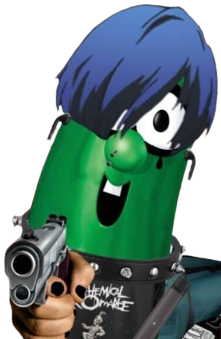

<div align="center">

<!--  -->

# EMO LARRY

### Description
This website was made as both a joke with some friends, and a learning curve. The Joke was that one of my friends watches a show called "VeggieTales" and there is a Cucumber called "Larry". Another one of my friends edited a photo of the character to make him dress up like a emo character. We laughed at the abomination and/or art piece for days and joked about creating a website for him to make him a website that plays "emo" music when the website loads up. So i created it and had it uploaded through github so they could see it and enjoy it too. My learning curve was inside my JavaScript, where i had the program start playing music when the user opens the page.

### JS that made this happen
</div>

```
// Add the paths of your downloaded songs to the list.
var songs = []
// This randomly picks a song.
var currentSong = songs[Math.floor(Math.random()*songs.length)]
// This is to keep multiple songs from playing constantly.
var counter = 0

function audioCue() {
    if (counter !== 1) {   
        // Initiates the audio. 
        var audio = new Audio(currentSong);
        // Makes the song play by its self.
        audio.autoplay = true
        // Loops the song.
        audio.loop = true
        counter++
        // Starts the song
        audio.play();
    }
}

audioCue()
```
<div align="center">
example in the file index.js.

### Songs used in this project

|    Song Names    |       Artists       |         Links to Song        |
|------------------|---------------------|------------------------------|
| 21 guns          | Green day           | https://youtu.be/r00ikilDxW4 |
| Black Parade     | My Chemical Romance | https://youtu.be/RRKJiM9Njr8 |
| Bring me to life | Evanescence         | https://youtu.be/3YxaaGgTQYM |
| Crawling         | Linkin Park         | https://youtu.be/Gd9OhYroLN0 |
| I am all of me   | Crush 40            | https://youtu.be/NucG0kD3pkg |
| In the end       | Linkin Park         | https://youtu.be/eVTXPUF4Oz4 |
| Miss You         | blink-182           | https://youtu.be/s1tAYmMjLdY |
| Numb             | Linkin Park         | https://youtu.be/kXYiU_JCYtU |

</div>